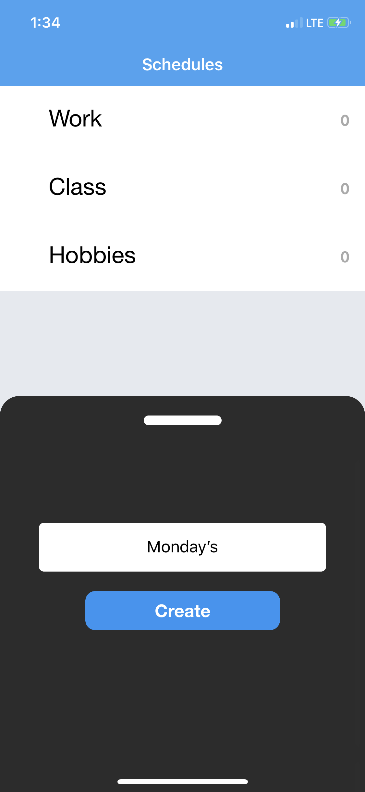
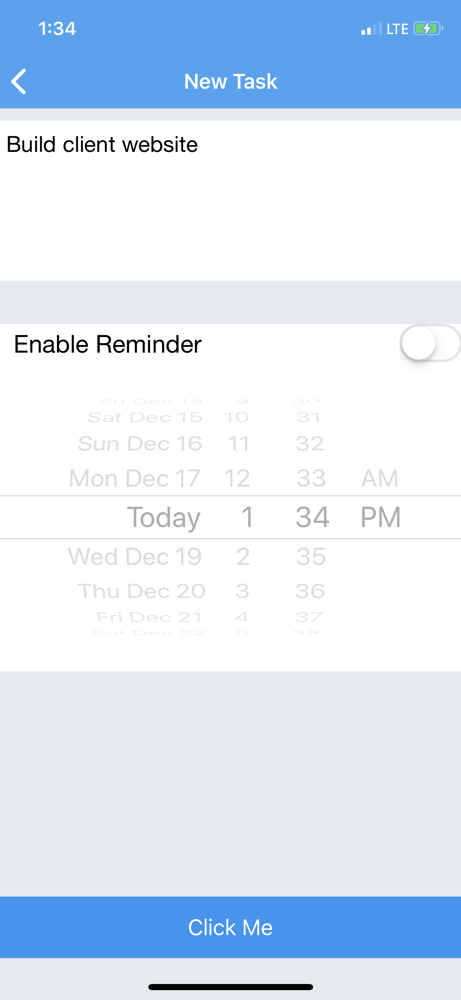
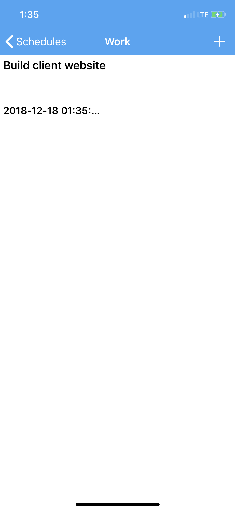

# Schedules

A simple, fluid To Do Scheduling app.

There's still some things needing to be done, and lots of features I want to add, but it's usable finally!

Here's some Screenshots of the App: 

The main page

I'm still deciding if I want to keep the pull up view, it's both handly and very un-ios-like

The Reminders Creation:

Reminders/Tasks list (I need to fix the date formatting)

I'm hoping to get this up on the iOS App Store soon (completely free, no ads or any of that).

But if you want to run it from github, download it, install the cocoapods, and should be good to go!
